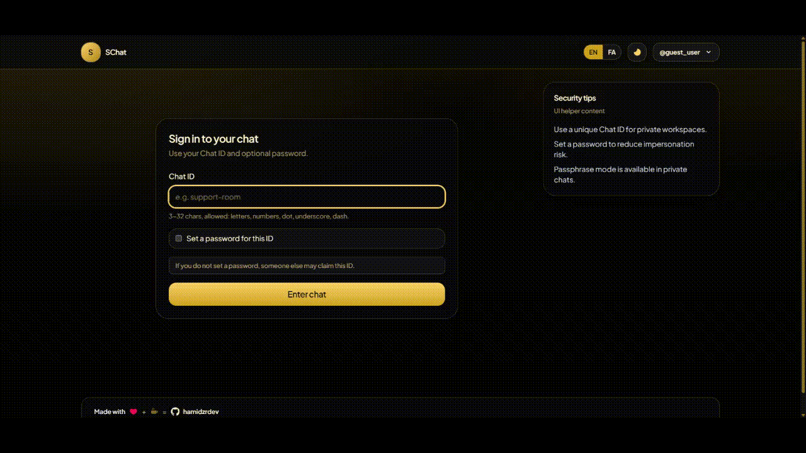
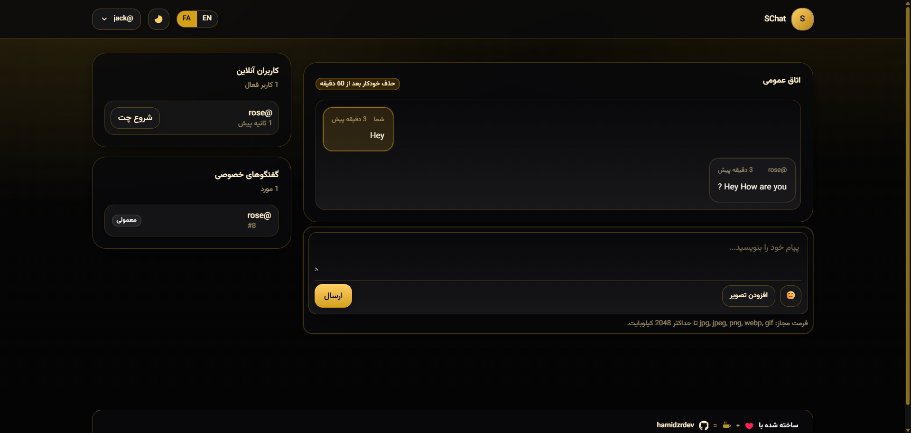
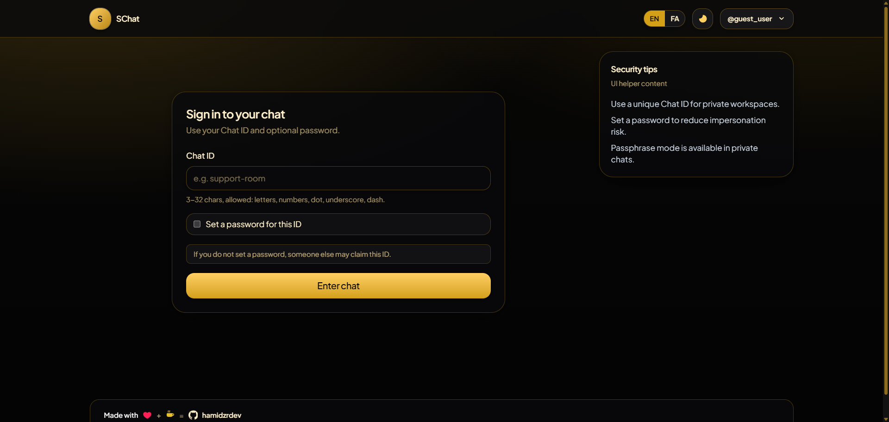
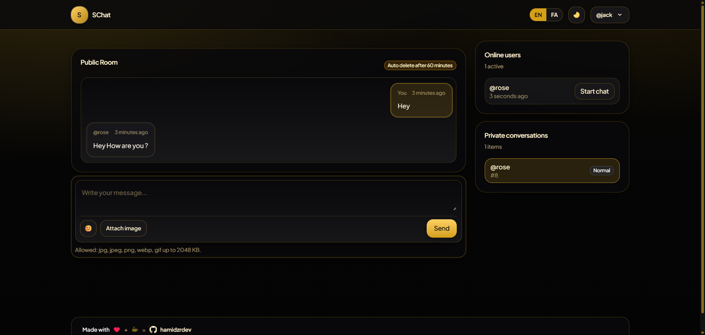

<p align="center">
  
</p>

<h1 align="center">Secure Chat</h1>

<p align="center">
  🇮🇷 <a href="README.fa.md">مشاهده نسخه فارسی</a>
</p>

---

Secure Chat is a real-time chat application built with Laravel and WebSocket (Laravel Reverb).  
It supports public and private messaging, encrypted passphrase-based chats, queue processing, scheduled jobs, and automatic message expiration.

---

## 🎬 Preview

<p align="center">
  
</p>

---

## 📸 Screenshots

<p align="center">
  
  
  
</p>

---

## 💬 Features

- Public Chat Room
- Private One-to-One Chat
- Passphrase-Based Encrypted Private Chat
- Real-Time Messaging via WebSocket (Laravel Reverb)
- Online Users Presence Indicator
- Server-Side Image Upload & Validation
- Automatic Message Deletion (TTL-Based)
- Queue Workers Processing
- Scheduled Jobs (Task Scheduler)
- Feature Toggle via Config File

---

## ⚙️ Requirements

- PHP 8.3+
- MySQL
- Laravel Reverb
- Composer
- Node.js & NPM

---

## 🛠 Manual Installation (Linux)

```bash
composer install

cp .env.example .env
php artisan key:generate

php artisan migrate
php artisan chat:setup

npm install
npm run build

php artisan optimize:clear
```

---

## 🚀 Running the Application

### Start Application (Port 8000)

```bash
php artisan serve --host=0.0.0.0 --port=8000
```

Access via:

http://localhost:8000

---

### Run Queue Worker

```bash
php artisan queue:work
```

---

### Run Scheduler

```bash
php artisan schedule:work
```

---

### Run WebSocket Server (Reverb – Port 8080)

```bash
php artisan reverb:start --host=0.0.0.0 --port=8080
```

Add to `.env`:

REVERB_PORT=8080

---

## 🐳 Docker Deployment

```bash
docker build -t secure-chat .
docker run -d -p 8000:8000 -p 8080:8080 secure-chat
```

Or:

```bash
docker-compose up -d
```
